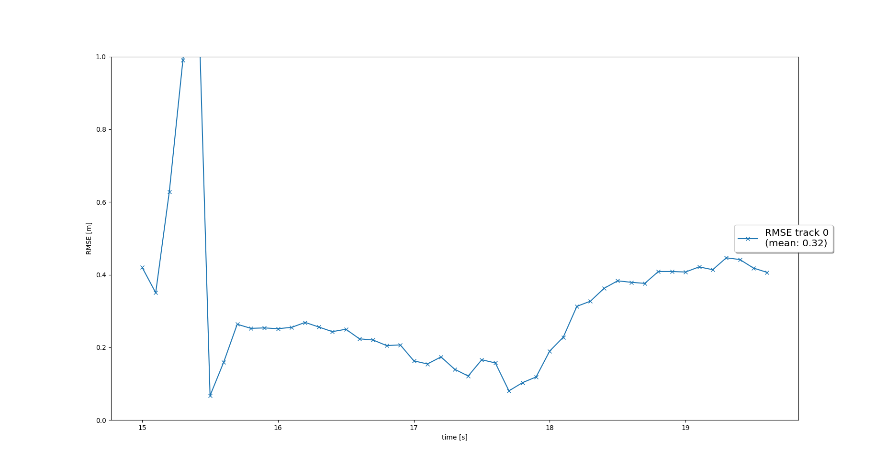
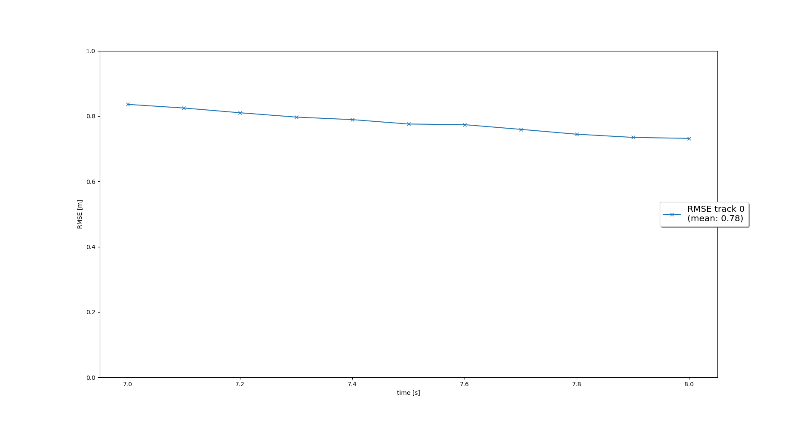
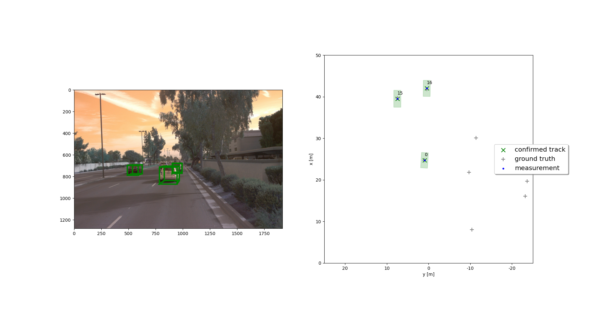
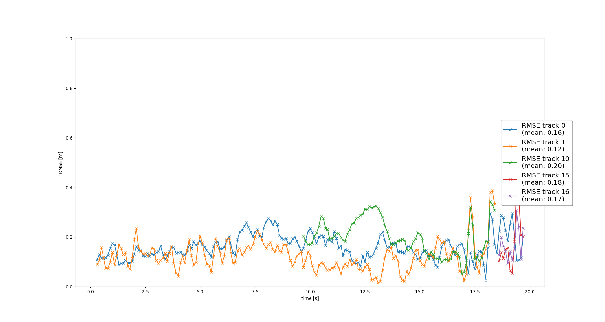
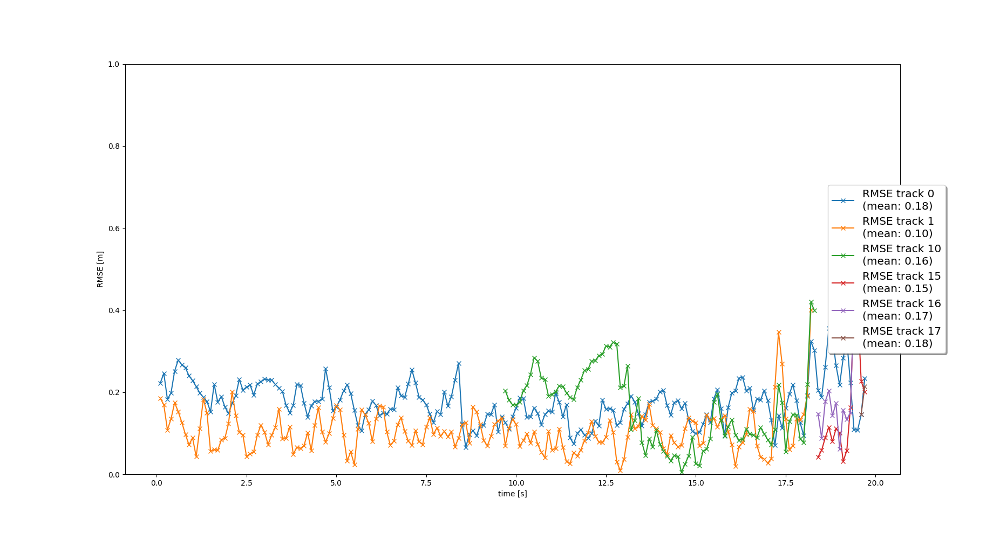

# Sensor-Fusion-and-Object-Tracking

## Task 1:
- EKF is implemented including appropriate system matrix F and process noise Q for constant velocity motion model.
- EKF is applied to a simple single-target scenario with lidar only.
- The mean RMSE is 0.35 or smaller. 
RMSE plot:

## Task 2:
- Track initialization from unassigned measurements is implemented.
- A track score is defined and implemented.
- Track states are defined and implemented, e.g. “tentative”, “confirmed”.
- Old tracks are deleted for not updated tracks.
- The tracking works properly if you see the following results: After applying the track management to a new sequence (see instructions), the visualization shows that a new track is initialized automatically where unassigned measurements occur, the true track is confirmed quickly, and the track is deleted after it has vanished from the visible range. There is one single track without track losses in between. 
RMSE plot:

## Task 3:
- Nearest neighbor data association including association matrix is implemented.
- A method that returns nearest track and measurement for association is implemented.
- Gating method with chi-square-distribution is implemented to reduce complexity.
- The association works properly if you see the following results: After applying the data association to a new sequence with multiple targets, multiple tracks are updated with multiple measurements. The console output shows that each measurement is used at most once and each track is updated at most once.
- The visualization should show that there are no confirmed “ghost tracks” that do not exist in reality. There may be initialized or tentative “ghost tracks” as long as they are deleted after several frames.

## Task 4:
- Camera measurements including appropriate covariance matrix R are implemented.
- Nonlinear camera measurement model h(x) is implemented. The Jacobian H is given.
- A method that checks whether an object can be seen by the camera or is outside the field of view is implemented.
- The tracking works properly if you see the following results: The tracking loop now updates all tracks with lidar measurements, then with camera measurements. The console output shows lidar updates followed by camera updates.
- The visualization shows that the tracking performs well, again no confirmed ghost tracks or track losses should occur.

## Conclusion:
RMSE plot shows at least three confirmed tracks. Two of the tracks are tracked from beginning to end of the sequence (0s - 200s) without track loss. The mean RMSE for these two tracks is below 0.25.
